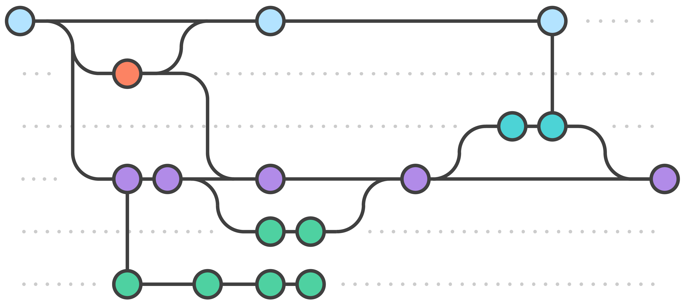

---
competencies:
- git-3
---

# Git branching

As you already know, Git is an extremely powerful tool. It has to be really mastered, in order to be able to use the best parts of it.

You already know how to add, commit, push your changes and you write nice commit messages (aren't you?). You also know how to pull code from others and fix the possible merge conflicts as a pro.

To simplify things: you're already semi-professional in git, but there are few things you should master to be able to call yourself a pro!

## Branching

Some of you already had the need to be able to work on their functionality, without having to pull other's changes continuously, causing merge conflicts, losing valuable time from the real work. This is why branching has been invented.

### Branching / merging

Branching means you diverge from the main line of development and continue to do work without messing with that main line. You've already used a branch, without your knowledge: whenever you committed your changes to git, you always did that to the branch called _master_.

Please read and understand the following articles about branching:

<https://www.atlassian.com/git/tutorials/using-branches>

<https://git-scm.com/book/en/v2/Git-Branching-Branches-in-a-Nutshell> (3.1-3.7, use the 'next' links in the bottom)

When you get the basic understanding about branching, please do the following interactive tutorial's first chapter (_Main/Introduction sequence_):
<http://learngitbranching.js.org>

You can experiment on katacode.com as well:
[Scenario 6 - Experiments Using Branches](https://www.katacoda.com/courses/git)

And check out this simple git guide as a recap:
<http://rogerdudler.github.io/git-guide/>

### Branching workflows

Branching is all about handling massive collaboration issues. But it's worthless, without using a workflow, in which the rules are kept by all participants.

A very simple branching workflow is the feature branch workflow, here you have one master branch and several branches for the features you are developing. Read about it on this page:

<https://www.atlassian.com/git/tutorials/comparing-workflows/feature-branch-workflow>

Building on the feature branch concept, the **Gitflow Workflow** is probably the most commonly used git workflow, it uses several well defined branch. Please read and understand the following article, and try it out on your next teamwork project:

<https://www.atlassian.com/git/tutorials/comparing-workflows/gitflow-workflow>

?> While working on your branch, it is a good idea to [update it regularly](https://remarkablemark.org/blog/2017/06/02/git-update-branch/) from the branch you opened it from. It is OK, if you use merge now, rebase will be discussed on 6th SI week.

> Optional articles to deepen you knowledge
>
> * For a more in-depth comparision you can read this page about several workflows: <https://www.atlassian.com/git/tutorials/comparing-workflows>
> * Git Distributed Workflows: <https://git-scm.com/book/en/v2/Distributed-Git-Distributed-Workflows>
> * Contributing to a Project: <https://git-scm.com/book/en/v2/Distributed-Git-Contributing-to-a-Project>
> * Revision tags in general: https://en.wikipedia.org/wiki/Revision_tag
> * Git tagging: https://git-scm.com/book/en/v2/Git-Basics-Tagging
>

## Handling pull requests on GitHub

GitHub is an awesome platform sitting on the top of their hosted git service, adding incredible features which ease the life of many developers. Since many company uses GitHub, nearly all of the open-source projects are hosted on GitHub, moreover, you use GitHub, it's worth checking one of it's best feature, called pull requests.

Please read and understand the following article about pull requests:

<https://help.github.com/articles/using-pull-requests/>

## How will we use this knowledge?

We are going to use Gitflow Workflow from the next TW week, so please make sure you understand how should it look like!

## You can be sure you understood this page if:

you can answer the following questions:

* What is git and what is a repository? _(seriously, can you explain these to a non-IT person?)_
* What does it mean to clone a repository?
* What does it mean to fork a repository?
* What is a branch in git? How do you create it? _(there are multiple ways)_
* What happens if you have commited your changes into a development branch and you checkout the master? Where are the development changes stored?
* How do you update your branch with the new commits from the branch you opened it from?
* What is a tag? Where is it stored? Can you commit it? Do you need to push/pull it?
* What is a merge commit? How does the default commit message look like?
* What is HEAD? What does it mean if it's detached?
* What is a pull request? Is it a git feature?

## You can test your knowledge by:

* Using git for your SI week assignments and creating branches for sub-tasks as practice.
* Finishing the interactive tutorials mentioned above
