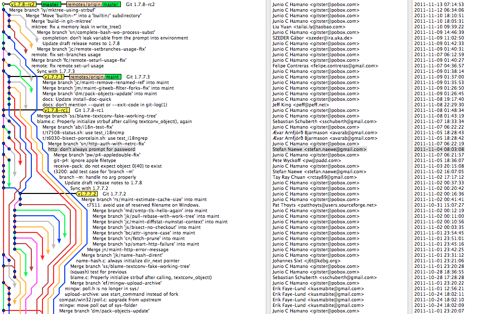

---
competencies:
- git-3
---

# Git GUI

Git is capable of complicated, enterprise level version control. To get the most out of it, one has to learn incredible amount of commands and parameters.

Also when several people are working on a project, it is highly possible that a complicated version tree will occur, like in this case: 

It is obvious, that developers need some tools to visualize git history in order to understand it.

Many tools have been developed, just to fulfill this need:

* A short list: <https://git-scm.com/downloads/guis>
* A long list: <https://git.wiki.kernel.org/index.php/InterfacesFrontendsAndTools>

Our recommendation is are
[Github Desktop](https://help.github.com/en/desktop/getting-started-with-github-desktop),
[GitKraken](https://www.gitkraken.com/)
or you can use Code editor with built-in version control capabilities like [Visual Studio Code](https://code.visualstudio.com/docs/editor/versioncontrol "Visual Studio Code Git integration").

## You can test your knowledge by:

* trying out a git GUI application
* creating a commit using that application
* checking out the git log in a visual representation of one of your previous projects
