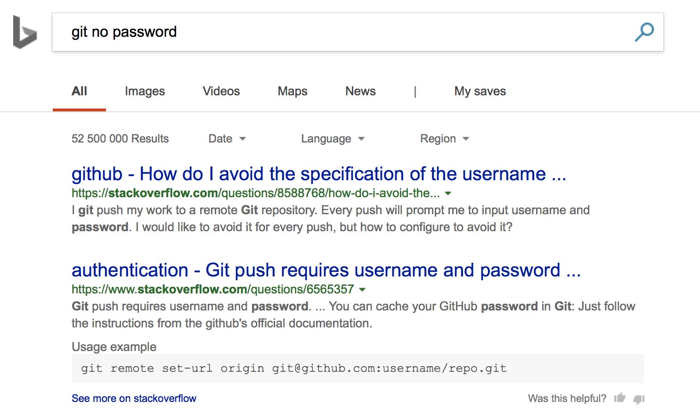

---
competencies:
- git-1
---

# Git without password

Git is great tool, but if you have used it for a while, you might have wondered - do I really have to type in that password every time I do git push?

The answer is obviously no, you don't have to.
And people were already looking to solve this problem since 320 BC:

## How?

Change your repository address to use SSH instead of HTTPS. Easy.

## Waaaat?

You will have to provide encryption keys for SSH to work: Public and private keys - these are "garbage"-files with some magic (mathematical) properties. If you encode using public key you can only decode using private key and vice versa. It's how asymmetric cryptography works. So in order to make it work:

You can follow the instructions of Github how to setup SSH keys on your machine and configuring your GitHub account to use it specifically.

[GitHub step-by-step tutorial about SSH keys](https://help.github.com/en/articles/connecting-to-github-with-ssh)

## Extras - when you just can't git enough

## diff-so-fancy

When you do a **git diff** command, the output shows what has changed. It's not super readable, **but...** there is a script which does much better job.

Like here:

See the project page: [https://github.com/so-fancy/diff-so-fancy](https://github.com/so-fancy/diff-so-fancy)

## kdiff3 or Meld

[Meld](http://meldmerge.org) and [kdiff3](http://kdiff3.sourceforge.net) are the tools which help to solve merge conflicts. Those tools show what changed and suggest which parts could be safely merged and which need extra review. Please try to solve couple conflicts by hand, i.e. editing the conflicted file manually and then see the difference when you use one of those tools. It's worth knowing they exist even though you can do the same on VSCode. Not everyone uses VSCode.
